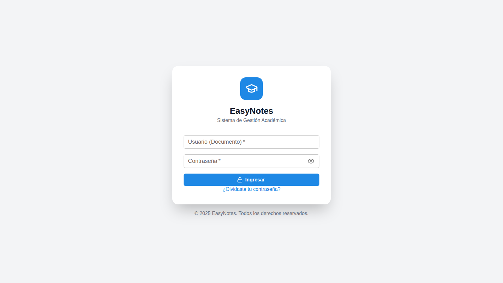
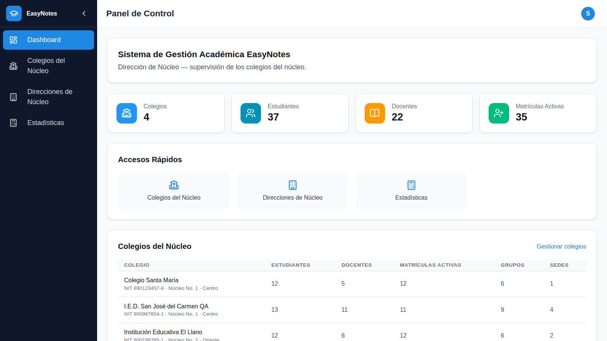
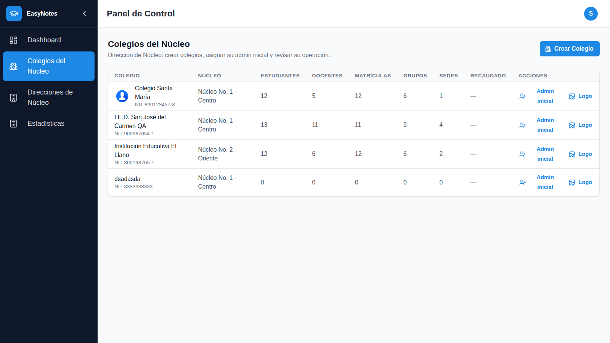
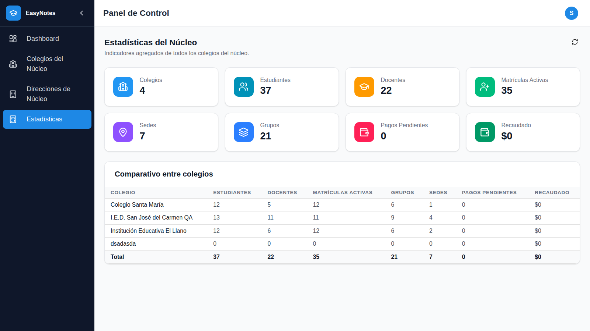

# EasyNotes v2

> Sistema de gestión educativa multi-institucional: matrículas, calificaciones, pagos, comunicación y más — construido con React y Node.js.


---

## Resumen

EasyNotes v2 es una plataforma web para la administración completa de instituciones educativas colombianas. Resuelve los procesos críticos de un colegio —desde la prematrícula pública en línea hasta la generación de boletines de calificaciones en PDF— en un solo sistema, con roles diferenciados para cada actor de la comunidad educativa y arquitectura multi-institucional (varios colegios o sedes en una misma instancia).

**El código fuente completo es privado.** Este repositorio contiene la documentación técnica del proyecto como parte de mi portafolio.

---

## Capturas

> **Cuenta utilizada en las capturas:** perfil **Super Admin** (`super` / `123456` en el entorno de demostración), el rol de máximo nivel: administra los núcleos y colegios de todas las instituciones. El login es el mismo para todos los perfiles; lo que cambia es el menú y los permisos según el rol.

**1. Login**



**2. Dashboard del Super Admin** — panel de dirección de núcleo con indicadores globales (colegios, estudiantes, docentes, matrículas activas) y accesos rápidos.



**3. Colegios del núcleo** — gestión de instituciones educativas con sus sedes, grupos y métricas.



**4. Estadísticas del núcleo** — indicadores agregados de todos los colegios supervisados.



---

## Stack tecnológico

**Frontend** — `client/`

| Tecnología | Uso |
|---|---|
| React 19 + Vite 8 | SPA, compilación y HMR |
| Tailwind CSS 4 | Estilos utilitarios |
| Material UI + Lucide | Componentes de interfaz |
| Zustand | Estado global |
| React Router 7 | Enrutamiento SPA |
| Axios | Cliente HTTP |

**Backend** — `server/`

| Tecnología | Uso |
|---|---|
| Node.js + Express 4 | API REST (34 rutas) |
| Mongoose 8 | ODM de MongoDB |
| JSON Web Tokens | Autenticación |
| Helmet, HPP, express-mongo-sanitize | Seguridad HTTP |
| express-rate-limit + express-validator | Limitación y validación |
| Puppeteer | Generación de boletines y certificados en PDF |
| Resend | Correos electrónicos |
| Jest + Supertest + mongodb-memory-server | Pruebas automatizadas |

**Despliegue** — Vercel (frontend estático + backend serverless con `serverless-http`).

---

## Módulos funcionales

- **Autenticación y usuarios** — login con JWT, recuperación de contraseña, cambio obligatorio en primer ingreso, gestión de usuarios por rol.
- **Prematrícula y matrícula** — formulario público de prematrícula por enlace institucional, proceso de matrícula con documentos y validación de NIT/documento colombiano.
- **Calificaciones y boletines** — actividades, indicadores, escalas, promedio por área, boletines y certificados generados en PDF.
- **Finanzas** — conceptos contables, cartera, pagos, historial financiero por estudiante.
- **Académico** — áreas, asignaturas, grupos, años académicos, carga académica, horarios, promoción y recuperaciones.
- **Comunicación** — comunicados, notificaciones y excusas.
- **Observador** — registro de novedades y seguimiento de estudiantes.
- **Gobierno estudiantil** — eventos electorales y votación.
- **Auditoría** — bitácora de acciones de todos los usuarios.
- **Reportes** — estadísticas por núcleo, informes y carga masiva desde Excel.

---

## Arquitectura

```
┌──────────────────────────┐        ┌──────────────────────────────┐
│   client/ (React SPA)    │  HTTP  │  server/ (API REST Express)  │
│  ─────────────────────   │◄──────►│  ─────────────────────────   │
│  views/    (41 vistas)   │  JSON  │  routes/     (34 rutas)      │
│  services/ ( Axios )     │  +JWT  │  middleware/ (auth, rbac)    │
│  store/    (Zustand)     │        │  controllers/ → services/    │
│  router/               │        │  models/ (29 esquemas)       │
└──────────────────────────┘        └──────────────┬───────────────┘
                                                   │ Mongoose
                                     ┌─────────────▼───────────────┐
                                     │        MongoDB              │
                                     │  (multi-tenant: núcleo →    │
                                     │   sede → estudiante)        │
                                     └─────────────────────────────┘
```

**Patrón en capas:** `routes → middleware (auth/validación/alcance) → controllers → services → models`.

**Aislamiento multi-tenant:** cada registro está ligado a un núcleo y, cuando aplica, a una sede. El middleware de alcance filtra todas las consultas por el contexto del usuario autenticado, de modo que una institución nunca ve los datos de otra.

---

## Roles y permisos

Ocho perfiles con autorización verificada en el servidor (nunca solo en el cliente):

| Perfil | Funciones principales |
|---|---|
| `superadmin` | Administración global de núcleos e instituciones |
| `admin` | Configuración institucional, usuarios, finanzas |
| `rector` | Consulta institucional e indicadores (solo lectura + indicador) |
| `coordinador` | Seguimiento académico de su área |
| `docente` | Calificaciones, actividades, horarios, observador |
| `secretaria` | Matrículas, comunicación, cartera |
| `estudiante` | Consulta de notas, horarios, excusas |
| `acudiente` | Seguimiento de hijos, pagos, comunicados |

Cámbiate de perfil dentro de la sesión (`ElegirPerfil`) sin volver a iniciar sesión.

---

## Seguridad

- **Contraseñas** con bcrypt (salt ≥ 10), nunca en texto plano.
- **JWT** con expiración; token se renueva en cada petición autenticada.
- **Rate limiting** diferenciado: login, recuperación de contraseña, escrituras, borrados y consultas pesadas.
- **Helmet** (headers HTTP), **HPP** (pollution de parámetros), **express-mongo-sanitize** (inyección NoSQL).
- **Validación** de todos los endpoints con `express-validator` (incluida validación de NIT y documento colombiano).
- **Autorización por rol** en el servidor (`authorize(...roles)`) más middleware de alcance por núcleo/sede.
- **Bitácora** de auditoría de acciones sensibles.

---

## Calidad de código

- **344 pruebas automatizados** en 24 suites (`Jest` + `Supertest` + MongoDB en memoria, sin necesidad de una base de datos real para correr los tests).
- Suites dedicadas a seguridad: escalada de roles, aislamiento entre tenants, permisos por sede, boletines y acceso a datos.
- Lint: `eslint` en el backend, `oxlint` en el frontend.

```bash
cd server && npm test
```

---

## Ejecución local

Requisitos: Node.js ≥ 18, MongoDB ≥ 6.0.

```bash
# Backend
cd server
npm install
cp .env.example .env   # configurar variables de entorno
npm run dev

# Frontend (otra terminal)
cd client
npm install
npm run dev
```

El frontend queda en `http://localhost:5173` y el API en `http://localhost:5000` (puerto por defecto).

---

## Estructura del proyecto

```
.
├── client/                 # Frontend React + Vite
│   └── src/{views,services,store,router,components}
├── server/                 # Backend Express
│   ├── src/{routes,controllers,services,models,middleware,config,utils}
│   ├── tests/              # 24 suites de pruebas
│   └── seed.js             # Datos de demostración
└── docs/                   # Documentación interna (privada)
```

---

## Contacto

- **GitHub:** [@tu-usuario](https://github.com/tu-usuario)
- **LinkedIn:** [tu-perfil](https://linkedin.com/in/tu-perfil)
- **Correo:** tu@email.com

---

Hecho con ❤️ como proyecto de portafolio. Si te interesa el proyecto o quieres conversar sobre él, escríbeme.
